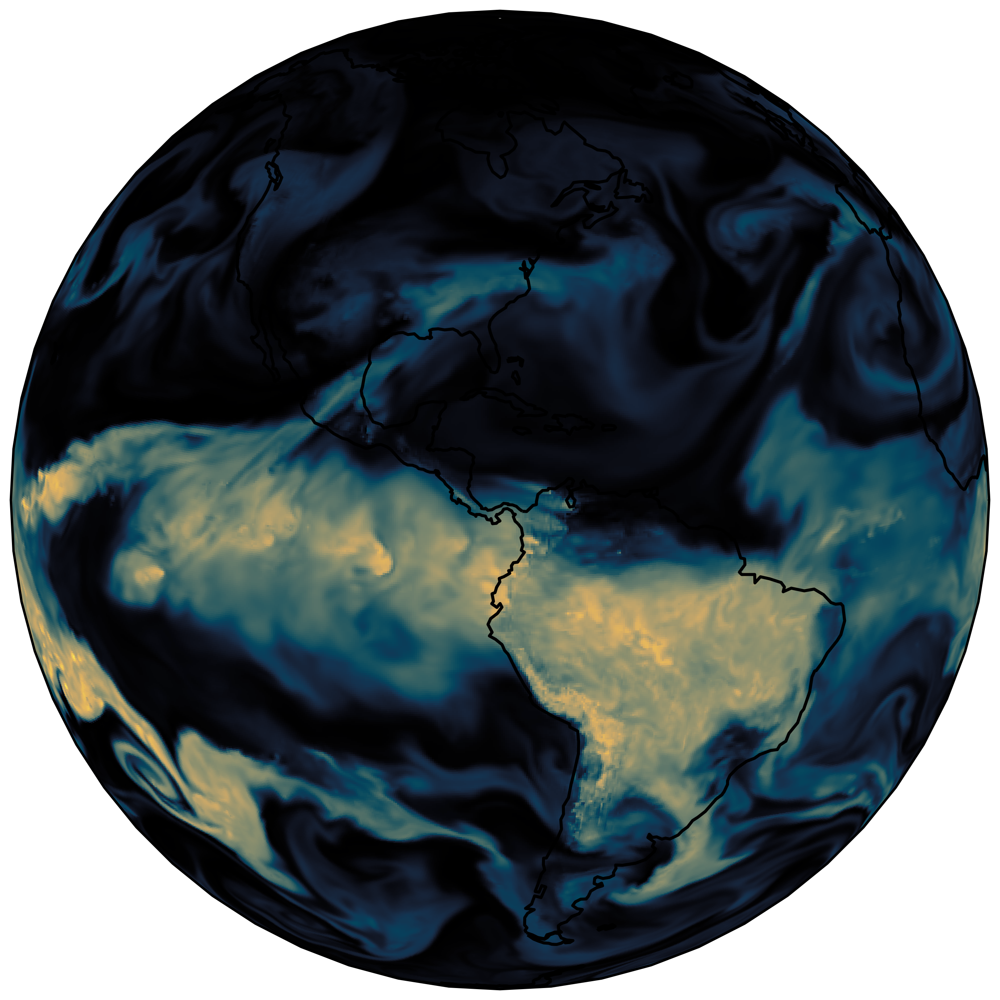
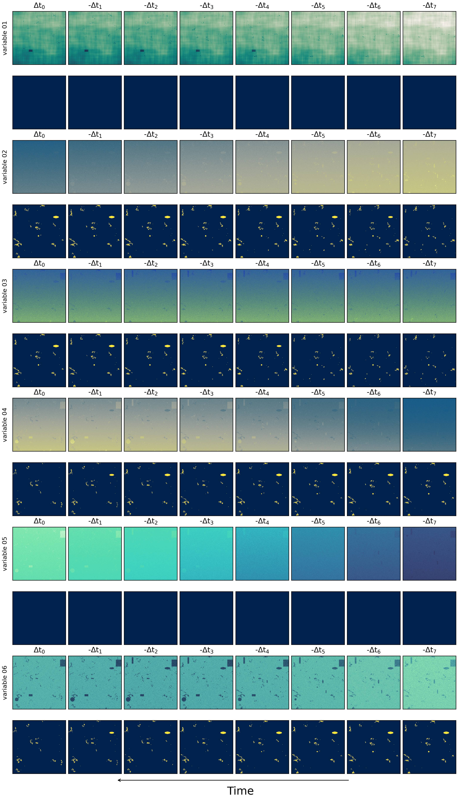
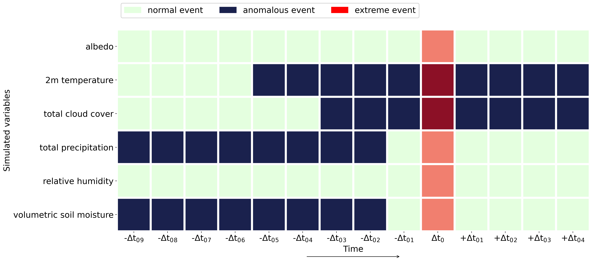
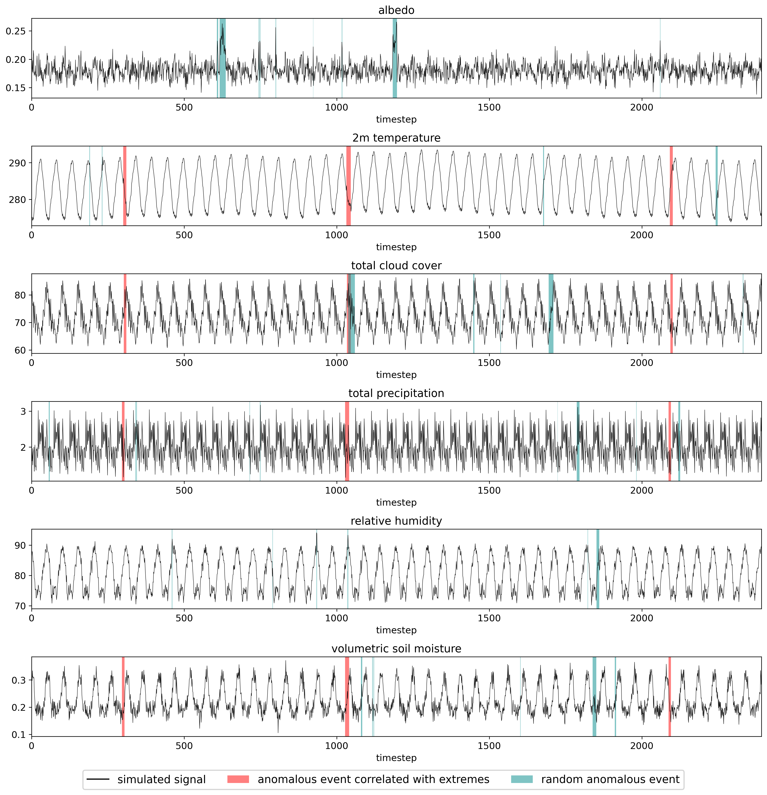

[](https://hakamshams.github.io/IDE/)
[](https://openreview.net/forum?id=DdKdr4kqxh)
[](https://arxiv.org/abs/2410.24075)
[](https://github.com/HakamShams/IDEE)


<!--- []() --->

  


# Synthetic Multivariate Anomalies

Computer Vision Group, Institute of Computer Science III, University of Bonn.

This is the code to generate the synthetic data presented in the paper:
["**Identifying Spatio-Temporal Drivers of Extreme Events**"](https://arxiv.org/abs/2410.24075) by [Mohamad Hakam Shams Eddin](https://hakamshams.github.io/), and [Juergen Gall](http://pages.iai.uni-bonn.de/gall_juergen/). Accepted at [NeurIPS'24](https://neurips.cc/virtual/2024/poster/96083).

### [Website](https://hakamshams.github.io/IDE/) | [Paper](https://openreview.net/forum?id=DdKdr4kqxh)


A python package to generate synthetic data that mimic the properties of Earth observations including anomalies.

The spatio-temporal relations of impacts of extreme events and their drivers in climate data are not fully understood and there is a need of machine learning approaches to identify such spatio-temporal relations from data. 
In our work, we propose a new appraoch and benchmarks to tackle this challenge. However, a challenge appeared as ground truth for impacts of extreme events can be derived from remote sensing or reported data, annotations of drivers or anomalies that are correlated with such extreme events barely exist. This is because the drivers of extreme events are not fully understood. Thus, we cannot quantitatively measure then accuracy of identifying drivers on real-world data. To solve this critical issue, we introduce a new synthetic dataset that mimics the properties of Earth observations including anomalies.

In the following, we explain the overall framework: 
(a) In a first step, we generate the normal data. For instance to generate synthetic data of 2m temperature from CERRA reanalysis, the normal signal at a specific time and location is generated based on the typical value of 2m temperature at that time and location (i.e., the median or mean value from a long-term climatology).
(b) The second step is to generate anomalous events. 
To achieve this, we assign spatio-temporally connected extreme events randomly in the data.
(c) Then based on a predefined coupling matrix between the variables and the extreme event, we generate anomalous events only for the variables that are defined to be correlated with the extremes.
(d) Finally, we add additional random anomalous events for all variables. 
The challenge is to identify the correlated anomalous events with extreme events. 

Below are some perceptual examples and a general description of the Framework.

## Synthetic artificial data

Perceptual examples of the synthetic artificial data. 
The target anomalies are visualized under each variable directly. 
Here, variables 01 and 05 are not correlated with the extremes.
These two variables don't have ground truth anomalies but only random anomalies.



<br />

## Coupling Matrix

An example of a randomly generated coupling matrix between the synthetic variables and
extremes for the synthetic CERRA dataset.

<div align="center">

</div>

<br />

## Time Series

Visualization of the generated signals for 6 different variables from the synthetic CERRA
reanalysis.  are the target anomalies which are correlated with extremes, 
and  are random anomalies.



<br />

## Setup

For pip, you can install dependencies using the requirements.txt file:
```
  pip install -r requirements.txt
```

## Code

The code has been tested under Python 3.10.6 on Ubuntu 20.04.5 LTS.


### Structure
```
├── configs
│   ├── exp_1.py
│   ├── exp_2.py
│   ├── exp_331.py
│   ├── exp_332.py
│   ├── exp_333.py
│   ├── exp_334.py
│   ├── exp_335.py
│   └── exp_3.py
├── data_base
│   └── index.gitkeep
├── docs
│   ├── gifs
│   │   └── animation_exp_3.gif
│   └── images
│       ├── 1314_14_exp1.jpg
│       ├── coupling_matrix_exp_3.png
│       ├── era5.png
│       ├── NeurIPS-logo.svg
│       ├── neurips-navbar-logo.svg
│       └── time_series_50_50_exp_3.png
├── log
│   └── index.gitkeep
├── main.py
├── README.md
├── requirements.txt
├── scripts
│   └── download_synthetic.sh
├── src
│   ├── base.py
│   ├── coupling.py
│   ├── datacube.py
│   ├── event.py
│   ├── noise.py
│   ├── utils.py
│   └── weight.py
└── visualize_datacube.py
```

### Configuration:

The configuration file to generate the data is stored in the directory [configs](configs). 
The name of the config file represents the name of the experiment.
Every config file is a combination of different variables, events and coupling setting between the anomalies and extreme events.
The folder [configs](configs) contains examples of config files to generate synthetic data:
- [exp_1](configs/exp_1.py): Artificial synthetic data
- [exp_2](configs/exp_1.py): Synthetic NOAA remote sensing
- [exp_3](configs/exp_1.py): Synthetic CERRA reanalysis

### Base signals

Base signals represent the normal behaviour of the variables. 
The script [base.py](src/base.py) contains the following types:
- Synthetic signal:
  - ConstantBase: Constant base signal
  - SineBase: Sine base signal
  - CosineBase: Cosine base signal
  - TrendBase: Trend base signal


- Synthetic signal based on real-world data:
  - NOAABase: NOAA Remote Sensing base signal
  - CERRABase: CERRA Reanalysis base signal
  
### Noise signals

The script [noise.py](src/noise.py) contains the following types:
- WhiteNoise: Signal sampled from a White noise
- CauchyNoise: Signal sampled from a Cauchy noise
- LaplaceNoise: Signal sampled from a Laplacian noise
- RedNoise: Signal sampled from a Red noise

### Weights

The weights are used to generated dependent variables from the independent base signals.
The dependent variables will be generated from a weighted combination of the independent base signals.
The script [weight.py](src/weight.py) contains the following types:
- Undisturbed weighting (weight is kept constant for each independent variable):
  - NormWeight: Weights sampled from the normal distribution
  - CauchyWeight: Weights sampled from the Cauchy distribution
  - LaplacWeight: Weights sampled from the Laplacian distribution
  

- Disturbed weighting (weight varies spatio-temporally w.r.t. events):
  - DisturbedNormWeight: Weights sampled from the normal distribution and disturbed based on anomalous events
  - DisturbedCauchyWeight: Weights sampled from the Cauchy distribution and disturbed based on anomalous events
  - DisturbedLaplaceWeight:  Weights sampled from the Laplacian distribution and disturbed based on anomalous events

### Events

The script [event.py](src/event.py) contains the following types:
- Related to anomalies:
  - EmptyEvent: Generate no events (i.e., for variables that don't include anomalies)
  - CubeEvent: Cube event (rectangular shape)
  - LocalEvent: Local event (one location/pixel)
  - GaussianEvent: Gaussian event (gaussian shape)
  - OnsetEvent: Onset event that starts at specific time and lasts until the end of the time series
  - RandomWalkEvent: Random walk event that starts at a specific pixel and affecting neighboring pixels with time


- Related to extremes:
  - ExtremeEvent: Event based on the number of anomalies before the event
  - ExtremeClass: Expand extreme events by additional classes before and after the extreme event. These classes represent less extreme classes.

### Coupling
Coupling is used to generate the dependent variables based on the weights defined in [weight.py](src/weight.py).
Events that occur in one of the independent base signals propagate to the new generated dependent signals.
The script [coupling.py](src/coupling.py) contains the following types:
- LinearCoupling: Linear coupling between the independent variables
- QuadraticCoupling: Non-linear quadratic coupling between the independent variables

Coupling is also used to define a random coupling matrix between the variables and the extreme events.
- ExtremeCoupling: Defines the coupling matrix between extremes and anomalous events


## Dataset

- Generated synthetic data can be downloaded from:
  [https://doi.org/10.60507/FK2/RD9E33](https://doi.org/10.60507/FK2/RD9E33) (~46 GB)
 
  You can also download the data via [script/download_synthetic.sh](scripts/download_synthetic.sh):
  ```
   wget --continue  https://bonndata.uni-bonn.de/api/access/datafile/7506 -O Synthetic.7z
  ```
  To extract the files you need the 7-Zip:
  ```
   sudo apt update
   sudo apt install p7zip-full
  ```
  and to extract:
  ```
   7za x Synthetic.7z
  ```
  
- If you want to generate synthetic data based on NOAA remote sensing or CERRA reanalysis, you have to download the preprocessed NOAA remote sensing and CERRA reanalysis data into the directory [data_base](data_base) from the Synthetic folder in [https://doi.org/10.60507/FK2/RD9E33](https://doi.org/10.60507/FK2/RD9E33) (~35 GB).


- If you want to generate synthetic data based on another dataset, you need to create a new Class like _NOAABase_ and _CERRABase_ in the script [base.py](src/base.py).


### Citation
If you find our work useful, please cite:

```
@inproceedings{
eddin2024identifying,
title={Identifying Spatio-Temporal Drivers of Extreme Events},
author={Mohamad Hakam Shams Eddin and Juergen Gall},
booktitle={The Thirty-eighth Annual Conference on Neural Information Processing Systems},
year={2024},
url={https://openreview.net/forum?id=DdKdr4kqxh}
}
```

### Acknowledgments

This work was funded by the Deutsche Forschungsgemeinschaft (DFG, German Research Foundation) within the Collaborative Research Centre SFB 1502/1–2022 - [DETECT](https://sfb1502.de/) - [D05](https://sfb1502.de/projects/cluster-d/d05) and by the Federal Ministry of Education and Research (BMBF) under grant no. 01IS24075C RAINA.

The codebase was built upon the julia package [DataFarm](https://github.com/esa-esdl/DataFarm). We thank the authors for sharing their code.

### License

The code is released under MIT License. See the [LICENSE](LICENSE) file for details.
